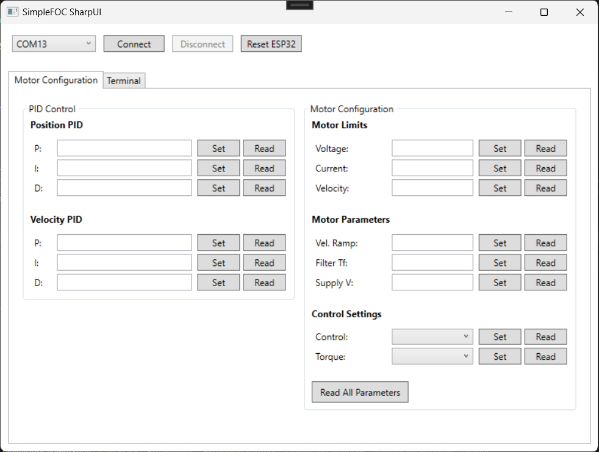

# SimpleFOCSharpUI


SimpleFOCSharpUI is a C# graphical interface for controlling SimpleFOC motor drivers. It provides an easy-to-use interface for serial communication with motor controllers.

## Features
- Simple and user-friendly UI
- Serial communication with motor drivers
- Real-time motor control and monitoring
- Lightweight and independent of Python

## Installation
1. Download the latest release from [GitHub Releases](https://github.com/fahreddinaykut/SimpleFOCSharpUI/releases).
2. Extract the downloaded files.
3. Run `setup.exe`.

## Usage
1. Connect your SimpleFOC-supported board to your PC.
2. Select the correct COM port.
3. Click "Connect" to establish a serial connection.
4. Use the interface to control and monitor your motor.

## Screenshot


## Example Code
```cpp
#include <SimpleFOC.h>
#include <Wire.h>

// Hardware pins
#define INH_A 4
#define INH_B 5
#define INH_C 6
#define SENSE_A A0
#define SENSE_B A1
#define SENSE_C A2

// Motor parameters
#define MOTOR_POLE_PAIRS 11
#define MOTOR_PHASE_RESISTANCE 5.6
#define MOTOR_KV 141.375

// FOC components
BLDCMotor motor = BLDCMotor(MOTOR_POLE_PAIRS, MOTOR_PHASE_RESISTANCE, MOTOR_KV);
BLDCDriver3PWM driver = BLDCDriver3PWM(INH_A, INH_B, INH_C);
InlineCurrentSense current_sense = InlineCurrentSense(0.01, 200, SENSE_A, SENSE_B, SENSE_C);
MagneticSensorI2C sensor = MagneticSensorI2C(AS5600_I2C);
Commander command = Commander(Serial);

// Control variables
float target_angle = 0;
uint8_t focStatus = 0;

void setup() {
  Serial.begin(115200);
  Wire.begin(40,41);

  SimpleFOCDebug::enable(&Serial);

  // Initialize hardware components
  sensor.init();
  motor.linkSensor(&sensor);

  // Driver configuration
  driver.voltage_power_supply = 8.4f;
  driver.pwm_frequency = 20000;
  driver.init();
  motor.linkDriver(&driver);

  // Current sense configuration
  current_sense.linkDriver(&driver);
  current_sense.init();
  motor.linkCurrentSense(&current_sense);

  // Motor limits
  motor.voltage_limit = 7.0f;
  motor.current_limit = 3;
  motor.velocity_limit = 20;
  motor.PID_velocity.output_ramp = 1000;
  motor.LPF_velocity.Tf = 0.01;

  // Motor control settings
  motor.sensor_direction = Direction::CW;
  motor.foc_modulation = FOCModulationType::SinePWM;
  motor.controller = MotionControlType::angle;
  motor.torque_controller = TorqueControlType::voltage;

  // PID parameters
  motor.PID_velocity.P = 0.05;
  motor.PID_velocity.I = 0.5;
  motor.PID_velocity.D = 0.0001;
  motor.P_angle.P = 20;

  // Initialize motor
  motor.useMonitoring(Serial);
  motor.init();
  
  if (motor.initFOC()) {
    Serial.println("FOC init success!");
    focStatus = 1;
  } else {
    Serial.println("FOC init failed!");
    focStatus = 0;
    return;
  }

  // Setup serial commands
  setupCommands();
  Serial.println("Motor ready!");
}

void loop() {
  if (focStatus == 0) return;
  
  motor.loopFOC();
  motor.move(target_angle);
  command.run();
}

void setupCommands() {
  command.add('M', cmdMotor, "motor");
  command.add('T', cmdTarget, "target angle");

  command.add('P', cmdPidP, "angle P gain");
  command.add('I', cmdPidI, "angle I gain");
  command.add('D', cmdPidD, "angle D gain");
  command.add('K', cmdVelPidP, "velocity P gain");
  command.add('L', cmdVelPidI, "velocity I gain");
  command.add('N', cmdVelPidD, "velocity D gain");

  command.add('V', cmdVoltageLimit, "voltage limit");
  command.add('C', cmdCurrentLimit, "current limit");
  command.add('S', cmdVelocityLimit, "velocity limit");
  command.add('R', cmdRamp, "velocity ramp");

  command.add('F', cmdLowPassFilter, "velocity filter Tf");
  command.add('U', cmdSupplyVoltage, "power supply voltage");
  command.add('W', cmdPWMFrequency, "PWM frequency");

  command.add('Y', cmdControllerType, "controller type");
  command.add('Z', cmdTorqueType, "torque type");
}

// Command handlers
void cmdMotor(char* cmd) { command.motor(&motor, cmd); }
void cmdTarget(char* cmd) { command.scalar(&target_angle, cmd); }

void cmdPidP(char* cmd) { 
  command.scalar(&motor.P_angle.P, cmd); 
  Serial.print("P:"); Serial.println(motor.P_angle.P, 3);
}

void cmdPidI(char* cmd) { 
  command.scalar(&motor.P_angle.I, cmd); 
  Serial.print("I:"); Serial.println(motor.P_angle.I, 3);
}

void cmdPidD(char* cmd) { 
  command.scalar(&motor.P_angle.D, cmd); 
  Serial.print("D:"); Serial.println(motor.P_angle.D, 3);
}

void cmdVelPidP(char* cmd) { 
  command.scalar(&motor.PID_velocity.P, cmd); 
  Serial.print("K:"); Serial.println(motor.PID_velocity.P, 3);
}

void cmdVelPidI(char* cmd) { 
  command.scalar(&motor.PID_velocity.I, cmd); 
  Serial.print("L:"); Serial.println(motor.PID_velocity.I, 3);
}

void cmdVelPidD(char* cmd) { 
  command.scalar(&motor.PID_velocity.D, cmd); 
  Serial.print("N:"); Serial.println(motor.PID_velocity.D, 3);
}

void cmdVoltageLimit(char* cmd) { 
  command.scalar(&motor.voltage_limit, cmd); 
  Serial.print("V:"); Serial.println(motor.voltage_limit, 3);
}

void cmdCurrentLimit(char* cmd) { 
  command.scalar(&motor.current_limit, cmd); 
  Serial.print("C:"); Serial.println(motor.current_limit, 3);
}

void cmdVelocityLimit(char* cmd) { 
  command.scalar(&motor.velocity_limit, cmd); 
  Serial.print("S:"); Serial.println(motor.velocity_limit, 3);
}

void cmdRamp(char* cmd) { 
  command.scalar(&motor.PID_velocity.output_ramp, cmd); 
  Serial.print("R:"); Serial.println(motor.PID_velocity.output_ramp, 3);
}

void cmdLowPassFilter(char* cmd) { 
  command.scalar(&motor.LPF_velocity.Tf, cmd); 
  Serial.print("F:"); Serial.println(motor.LPF_velocity.Tf, 3);
}

void cmdSupplyVoltage(char* cmd) { 
  command.scalar(&driver.voltage_power_supply, cmd); 
  Serial.print("U:"); Serial.println(driver.voltage_power_supply, 3);
}

void cmdPWMFrequency(char* cmd) { 
  float freq;
  command.scalar(&freq, cmd);
  driver.pwm_frequency = (long)freq;
  Serial.print("W:"); Serial.println(driver.pwm_frequency);
}

void cmdControllerType(char* cmd) { 
  float type_float = (float)motor.controller;
  command.scalar(&type_float, cmd);
  if (!command.isSentinel(cmd[0])) {
    motor.controller = (MotionControlType)(int)type_float;
  }
  Serial.print("Y:"); Serial.println((int)motor.controller);
}

void cmdTorqueType(char* cmd) { 
  float type_float = (float)motor.torque_controller;
  command.scalar(&type_float, cmd);
  if (!command.isSentinel(cmd[0])) {
    motor.torque_controller = (TorqueControlType)(int)type_float;
  }
  Serial.print("Z:"); Serial.println((int)motor.torque_controller);
}
```

## Requirements
- Windows OS
- .NET Runtime (if required)

## Contributing
Pull requests are welcome. For major changes, please open an issue first to discuss your ideas.

## License
This project is licensed under the MIT License.

